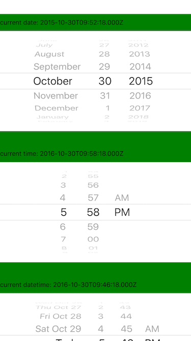
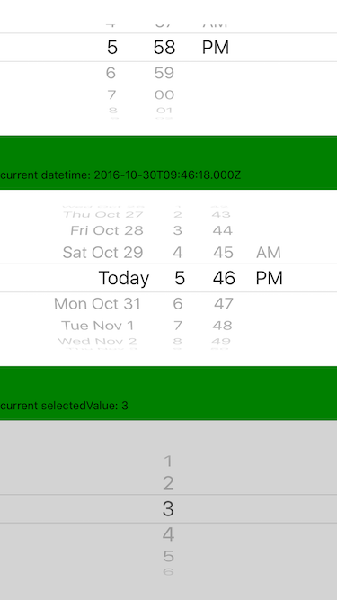
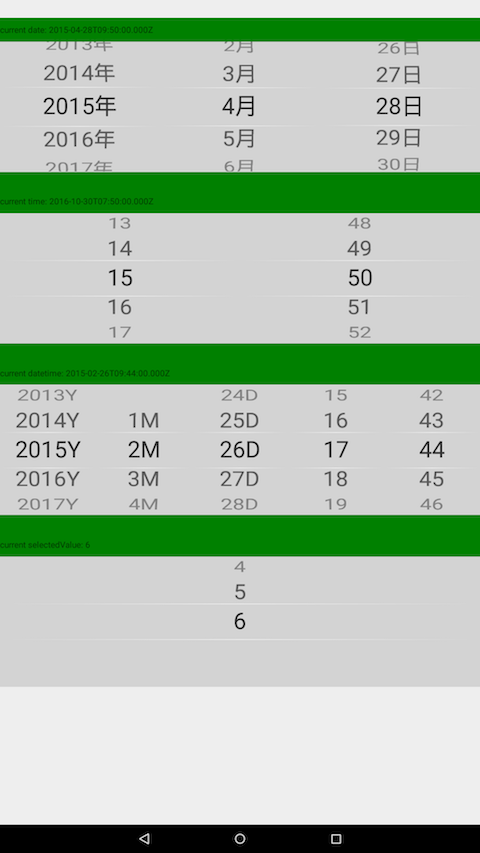

# rn-wheel-picker

A iOS style picker and datepicker components for ReactNative.

- Original repository by @lesliesam: [react-native-wheel-picker](https://github.com/lesliesam/react-native-wheel-picker).
- Fork with added the real cross platform behavior and datepicker by @wusuopu [react-native-wheel-picker](https://github.com/wusuopu/react-native-wheel-picker).

This is the third fork of repository and its targeted to support and maintain current code. I asked github team to make it my own as is all pull requests goes directly to @lesliesam original repository but it seems to be no longer maintained.

## Introduction
Cross platform Picker component for React-native.

Since picker is originally supported by iOS while Android only supports a ugly Spinner component. If you want to have the same user behaviour, you can use this.

The android component is based on [wheel-picker](https://github.com/AigeStudio/WheelPicker) which runs super fast and smoothly. It also supports curved effect which make it exactly the same looking and feel as the ios picker.






## How to use

Run command

For apps using RN 0.32 or higher, please run

```
npm i react-native-wheel-picker --save
```

For apps using RN 0.31 or less, please run

```
npm install --save --save-exact react-native-wheel-picker@1.9.0
```

Configration:

```
react-native link rn-wheel-picker
```

## Example code

```jsx
import { Picker, DatePicker } from 'rn-wheel-picker';

// use DatePicker
<DatePicker
  mode="date"
/>

// use Picker
<Picker
  style={{ flex: 1 }}
  selectedValue={1}
  pickerData={[1, 2, 3, 4, 5, 6]}
  onValueChange={value => this.setState({ value })}
/>
```
